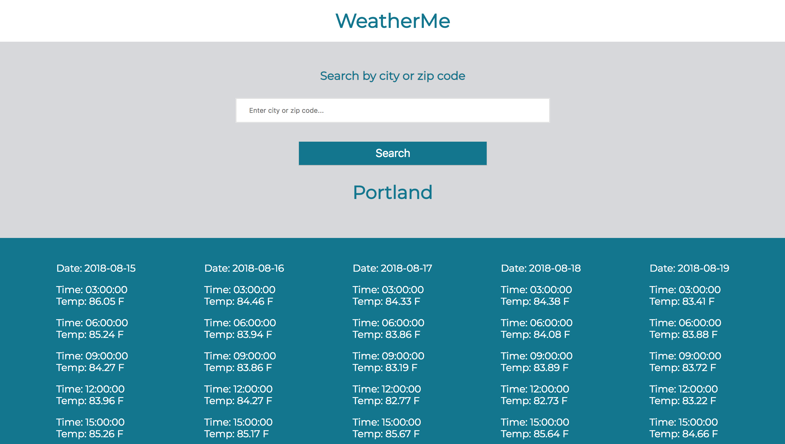

# Weather Me

Link to live application: https://weather-me-hsanchez.herokuapp.com/

Updates to this application are located on branch hs-updates.

# Application Description

This application retrieves data from https://openweathermap.org/api API.  The user is able to search by city name or zip code to retrieve the 5 day weather forecast for any city in the United States.  Built using jQuery, JavaScript, HTML5, CSS3, Node.js, compiled and bundled using Webpack and Babel.

